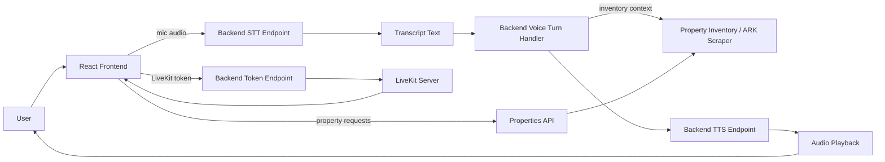
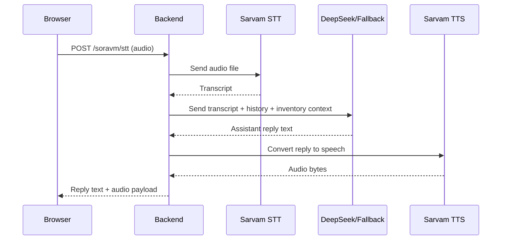
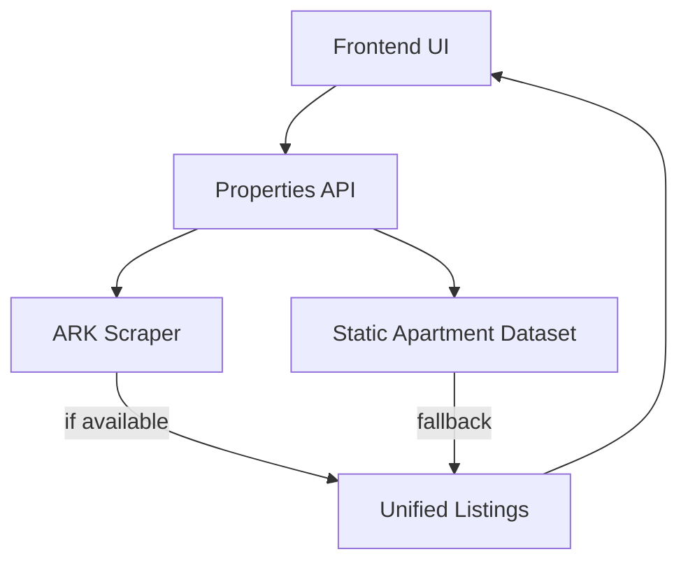

# RealEstateAgent

This repository is a full-stack real estate assistant demo. It combines a React + Vite frontend, a FastAPI backend, LiveKit-based voice transport, and property inventory services so a user can explore listings, ask for guidance, and interact by voice or text.

## What this project does

The app provides three main experiences:

1. Voice-first real estate assistance
   - The user speaks into the mic.
   - Audio is sent to the backend for speech-to-text.
   - The backend builds a reply using inventory context and an LLM.
   - The reply is converted to speech and played back.

2. Property discovery UI
   - The app shows city-based property cards and a map.
   - It can highlight locations and recommended projects based on the conversation.
   - The frontend can also trigger quick actions such as site visits or price trend inquiries.

3. Backend inventory + voice pipeline
   - The backend exposes endpoints for token generation, transcript handling, and property listing retrieval.
   - It also supports property discovery from a static inventory dataset and from an ARK Group scraper.

---

## Tech stack

- Frontend: React, TypeScript, Vite, Leaflet, Tailwind-like UI styling, livekit-client
- Backend: FastAPI, Python, JWT, Requests, Python-dotenv
- Voice transport: LiveKit
- Speech AI: Sarvam STT/TTS
- LLM layer: DeepSeek (with fallback rule-based responses)
- Property data: static JSON-style inventory + ARK Group scraper

---

## Repository structure

```text
root/
├── src/
│   ├── App.tsx                     # Main UI and orchestration
│   ├── main.tsx                    # App entry point
│   ├── components/
│   ├── features/
│   │   ├── map/
│   │   └── properties/
│   └── assets/
├── backend/
│   ├── app.py                      # FastAPI app and API routes
│   ├── routers/
│   ├── services/
│   ├── data/
│   ├── docker-compose.yml
│   ├── livekit.yaml
│   ├── requirements.txt
│   └── README.md
├── package.json
├── vite.config.ts
└── README.md
```

---

## High-level architecture



---

## End-to-end flow

### 1) Frontend startup

When the app launches:

- the React app loads in the browser
- it fetches backend config from the `/config` endpoint
- it initializes the main chat-style real estate experience

### 2) Voice pipeline setup

When the user clicks the pipeline controls:

- the frontend requests a LiveKit access token from the backend
- the backend generates a signed JWT for the room and user identity
- the frontend connects to LiveKit and enables the microphone

### 3) Speech capture and transcription

When the user speaks:

- the browser records audio chunks with `MediaRecorder`
- voice activity detection decides when a speech segment is meaningful
- once enough speech is detected, the audio blob is uploaded to the backend STT endpoint
- the backend forwards it to Sarvam STT and returns a transcript

### 4) Reply generation

The transcript is then sent to the backend voice-turn endpoint:

- the backend keeps session-based conversation history
- it detects city intent from the text
- it gathers property inventory context for the detected city
- it uses DeepSeek if configured, otherwise it falls back to a local rule-based real-estate reply

### 5) Text-to-speech playback

The textual reply is converted into audio:

- the backend asks Sarvam TTS for speech audio
- the frontend receives base64 audio and plays it back in the browser

### 6) Property listing flow

When the user wants listings or maps:

- the frontend calls the property endpoints
- the backend returns apartments for the selected city
- the UI renders cards, highlights locations, and updates the map

---

## File-by-file explanation

### Root files

- [package.json](package.json)  
  Defines frontend scripts such as `npm run dev`, `npm run build`, and `npm run lint`, plus dependencies for React, Vite, Leaflet, LiveKit, and Three.js.

- [vite.config.ts](vite.config.ts)  
  Vite config for the app, including React plugin setup.

- [tsconfig.json](tsconfig.json) and related TypeScript configs  
  Configure TypeScript for the app and the Vite build pipeline.

### Frontend entry and shell

- [src/main.tsx](src/main.tsx)  
  Starts the React app and mounts the root component into the DOM.

- [src/App.tsx](src/App.tsx)  
  The core of the application. This file orchestrates:
  - UI state for the agent, map, quick actions, and settings
  - microphone recording and voice activity detection
  - LiveKit connection setup
  - STT and TTS requests to the backend
  - property selection and conversation turn handling

### Frontend UI components

- [src/components/SpeakingAvatar.tsx](src/components/SpeakingAvatar.tsx)  
  Displays the assistant avatar and status state such as listening, thinking, or speaking.

- [src/features/map/PropertyMap.tsx](src/features/map/PropertyMap.tsx)  
  Renders the property map. It can switch between a Leaflet map and a globe-style view.

- [src/features/map/createPropertyMarker.ts](src/features/map/createPropertyMarker.ts)  
  Builds the custom marker HTML and positioning logic for properties on the map.

- [src/features/map/cityCenters.ts](src/features/map/cityCenters.ts)  
  Stores default center coordinates and zoom values for each supported city.

- [src/features/properties/ApartmentCard.tsx](src/features/properties/ApartmentCard.tsx)  
  Renders a property card in the recommendation section.

- [src/features/properties/api.ts](src/features/properties/api.ts)  
  Fetches properties from the backend and provides fallback hardcoded apartment data when the backend is unavailable.

- [src/features/properties/types.ts](src/features/properties/types.ts)  
  Contains the apartment data model and tag classes.

- [src/features/properties/useApartments.ts](src/features/properties/useApartments.ts)  
  A hook for loading apartments by city.

### Backend core

- [backend/app.py](backend/app.py)  
  The main FastAPI application. It:
  - loads environment variables
  - defines the main API endpoints
  - generates LiveKit tokens
  - handles STT/TTS proxying
  - builds voice replies with inventory context
  - keeps session-wise conversation memory

- [backend/routers/properties.py](backend/routers/properties.py)  
  Exposes property endpoints such as listing apartments by city or fetching one apartment by ID.

- [backend/services/inventory.py](backend/services/inventory.py)  
  Converts the user’s text into a city, fetches apartment inventory for that city, and creates context blocks for the LLM.

- [backend/services/ark_scraper.py](backend/services/ark_scraper.py)  
  Scrapes ARK Group property pages, parses project details, and caches them in memory so the app can enrich inventory without a database.

- [backend/data/apartments.py](backend/data/apartments.py)  
  Static fallback inventory used when scraper data is not available or when the city is not covered.

### Backend deployment and config

- [backend/docker-compose.yml](backend/docker-compose.yml)  
  Starts the local LiveKit server in Docker.

- [backend/livekit.yaml](backend/livekit.yaml)  
  LiveKit server settings and credentials.

- [backend/requirements.txt](backend/requirements.txt)  
  Python dependencies required by the backend.

- [backend/README.md](backend/README.md)  
  Backend-specific setup notes.

---

## Backend API flow



---

## Property data flow



The app does not rely on a database yet. Instead, it uses either:

- live-scraped ARK Group data when available, or
- a local static inventory list as fallback

This makes the demo easy to run locally while still supporting realistic property discovery behavior.

---

## How the voice experience is implemented

The main voice loop in [src/App.tsx](src/App.tsx) is intentionally split into small steps:

1. start microphone capture
2. detect speech activity
3. stop the segment once silence is detected
4. send the audio to the backend STT endpoint
5. send the transcript to the voice-turn endpoint
6. play the returned audio reply

This gives the UI a natural conversational rhythm and keeps the actual AI logic on the backend, where API keys and model calls are safer.

---

## Local development setup

### 1) Install frontend dependencies

```powershell
npm install
```

### 2) Set up the backend environment

```powershell
cd backend
copy .env.example .env
```

Then fill in the required values for:

- LiveKit API key and secret
- LiveKit URL
- Sarvam API key
- DeepSeek API key (optional, but recommended if you want LLM replies instead of local fallback)

### 3) Start LiveKit

From the repo root:

```powershell
docker compose up livekit
```

### 4) Start the backend

```powershell
cd backend
python -m venv .venv
.\.venv\Scripts\Activate.ps1
pip install -r requirements.txt
uvicorn app:app --reload --host 0.0.0.0 --port 8000
```

### 5) Start the frontend

```powershell
npm run dev
```

Then open the frontend in your browser. The default frontend URL is usually:

- http://localhost:5173

---

## Important runtime ports

- 5173 → frontend
- 8000 → FastAPI backend
- 7880 → LiveKit signaling
- 7881 → LiveKit fallback
- UDP 40000–40100 → LiveKit media traffic

---

## Notes and conventions

- The frontend keeps the main conversation UI and speech logic in one place for simplicity.
- The backend is the trusted boundary for API secrets and external model calls.
- The property inventory is currently lightweight and can be replaced later with a real database or CMS.
- The app includes fallback behavior so it still works reasonably even if some external services are unavailable.

---

## Summary

This project is best understood as three connected layers:

- the voice and UI layer in [src/App.tsx](src/App.tsx)
- the AI and property-service layer in [backend/app.py](backend/app.py)
- the transport and data layer in [backend/docker-compose.yml](backend/docker-compose.yml) and [backend/services/ark_scraper.py](backend/services/ark_scraper.py)

Together they create a local demo of a voice-driven real estate assistant that can answer questions, recommend listings, and guide the user through a property search journey.
